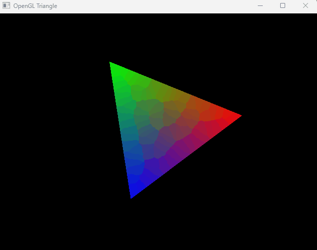

# RealtimeRendererGL
Building a real-time renderer using OpenGL. Learning and sharing progress with OpenGL.

## Progress

  
  

## Resources

1. [Max Liani's Blog](https://maxliani.wordpress.com/2021/05/28/offline-to-realtime-the-beginning-of-a-journey/)
2. [Learn OpenGL](https://learnopengl.com/)
3. [GLFW Tutorial](https://www.glfw.org/docs/latest/quick_guide.html)
